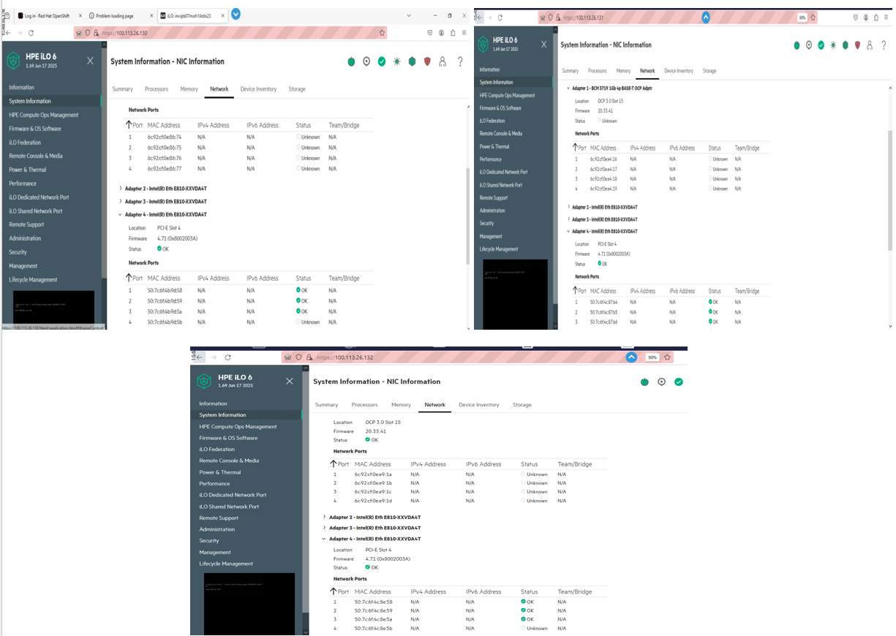

////
Purpose
-------
In the "Base" directory, this section is a placeholder which is to be
overwritten by implementation details specific to the product or products being
delivered.

If "TODO" appears in your document after the init script has been run, then
your product directory is missing a corresponding "implementation.adoc" which
should be created to provide a basic implementation framework for that product.
////

To ensure a successful OpenShift Container Platform (OCP) installation on bare metal infrastructure using the Agent Base Infrastructure (ABI) method, it's essential to meet specific prerequisites. These prerequisites include preparation of install-config.yaml and agent-config.yaml file, ensuring subscriptions are attached, installing the OpenShift command line tools, configuring the DNS entries, setting up an NTP server, and establishing the required networking configuration on the Bastion node. Each of these components plays a critical role in the deployment process, providing a stable and secure foundation for the {ocpversion} environment.

== Bastion user configuration

Perform the following steps to prepare the environment.

1. Log in to the bastion node via ssh.
+
2. Create a non-root user (pbvbsc2c) and provide that user with sudo privileges:
+
[source, bash]
----
# Add kni user
useradd pbvbsc2c

# Change password to redhat
echo 'pbvbsc2c:******' | chpasswd

# Add it to sudoers
echo "pbvbsc2c ALL=(root) NOPASSWD:ALL" | tee -a /etc/sudoers.d/pbvbsc2c
chmod 0440 /etc/sudoers.d/pbvbsc2c
----
+
3. Create an ssh key for the new user:
+
[source, bash]
----
[root@invipb07moh1bast1sm home]# su - ocpvbsc2 -c "ssh-keygen -t ed25519 -f /home/ocpvbsc2/.ssh/id_rsa -N ''"
Generating public/private ed25519 key pair.
Created directory '/home/ocpvbsc2/.ssh'.
Your identification has been saved in /home/ocpvbsc2/.ssh/id_rsa
Your public key has been saved in /home/ocpvbsc2/.ssh/id_rsa.pub
The key fingerprint is:
SHA256:YnIGPQMadMYtDBLdhy6wO0Xf4tgRGqzeEQMbDyH0q3Y ocpvbsc2@invipb07moh1bast1sm.pbstd.vil.local
The key's randomart image is:
+--[ED25519 256]--+
|=@*=+o           |
|o.@BBoo          |
| *.B+=+          |
|o +.*..o         |
|.o.*oo= S        |
|o.o.o= .         |
| + E             |
|. .              |
|                 |
+----[SHA256]-----+
----
+
4. From now on, you will use the `pbvbsc2c` user for the OCP installation.

== Create Deployment Folder

[source, bash]
----
[root@invipb07moh1bast1sm home]# su - ocpvbsc2
Last login: Wed Feb 25 00:58:57 IST 2026 on pts/4
[ocpvbsc2@invipb07moh1bast1sm ~]$ mkdir ocp4.18
[ocpvbsc2@invipb07moh1bast1sm ~]$ cd ocp4.18/
[ocpvbsc2@invipb07moh1bast1sm ocp4.18]$ mkdir ocpconfig
[ocpvbsc2@invipb07moh1bast1sm ocp4.18]$ cd ocpconfig
[ocpvbsc2@invipb07moh1bast1sm ocpconfig]$ mkdir openshift
----

== Create pull Secret File

[source, bash]
----
[pbvbsc2c@invibh19ptn1bast1sm ~]$ mkdir .docker
[ocpvbsc2@invipb07moh1bast1sm ~]$ vi .docker/config.json
----

== Copy oc kubectl openshift-install file in to pbvbsc2c folder 

[source, bash]
----
[root@invibh19ptn1bast1sm ocpvbsc2]# cp oc kubectl openshift-install ../pbvbsc2c
[root@invibh19ptn1bast1sm ocpvbsc2]# chown pbvbsc2c:pbvbsc2c ../pbvbsc2c/*
[root@invibh19ptn1bast1sm ocpvbsc2]# cd ../pbvbsc2c
[root@invibh19ptn1bast1sm pbvbsc2c]# ls -lrt
total 1007468
drwxr-xr-x. 4 pbvbsc2c pbvbsc2c        34 Dec 19 13:53 ocp4.18
-rwxr-xr-x. 1 pbvbsc2c pbvbsc2c 660381848 Dec 19 14:35 openshift-install
-rwxr-xr-x. 1 pbvbsc2c pbvbsc2c 185626776 Dec 19 14:35 oc
-rwxr-xr-x. 1 pbvbsc2c pbvbsc2c 185626776 Dec 19 14:35 kubectl
----

== Verify the Server details, MAC address, Disk details

.: Master MAC Address

