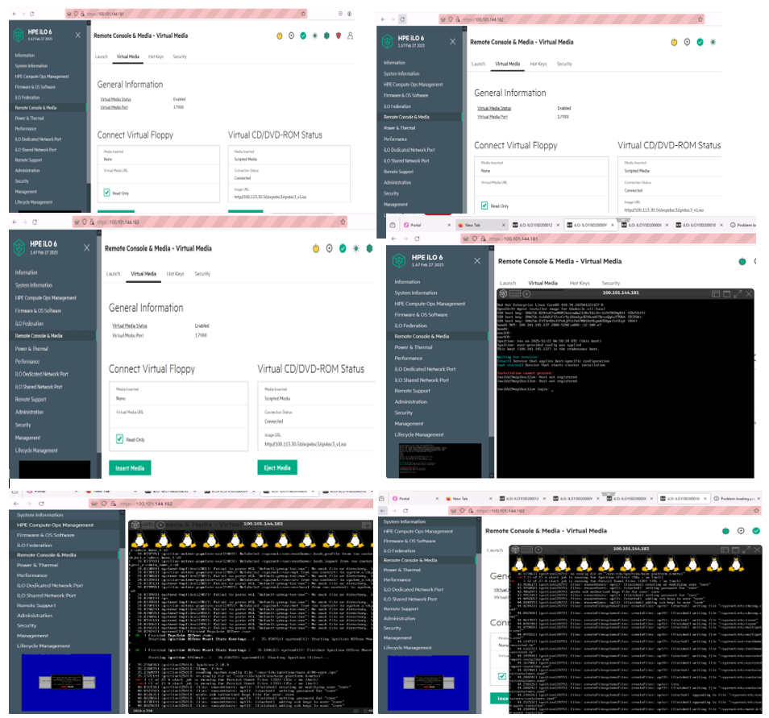

////
Purpose
-------
In the "Base" directory, this section is a placeholder which is to be
overwritten by implementation details specific to the product or products being
delivered.

If "TODO" appears in your document after the init script has been run, then
your product directory is missing a corresponding "implementation.adoc" which
should be created to provide a basic implementation framework for that product.
////

== Install Config file Preparation

[source, yaml]
----
apiVersion: v1
baseDomain: vil.local
cpuPartitioningMode: AllNodes
compute:
- hyperthreading: Enabled
  name: worker
  replicas: 0
controlPlane:
  hyperthreading: Enabled
  name: master
  replicas: 3
metadata:
  name: pbvbsc2c
networking:
  machineNetwork:
    - cidr: 100.109.182.64/28
    - cidr: 2400:5200:a000::c:100:e0/124
  clusterNetwork:
    - cidr: 10.128.0.0/14
      hostPrefix: 23
    - cidr: fd01::0/48
      hostPrefix: 64
  serviceNetwork:
    - 172.30.0.0/16
    - fd02::0/112
  networkType: OVNKubernetes
platform:
  baremetal:
    hosts:
      - name: invipb07moh1bsc21sm
        role: master
        bootMACAddress: 6c:92:cf:0e:e4:16
      - name: invipb07moh1bsc22sm
        role: master
        bootMACAddress: 6c:92:cf:0e:e9:1a
      - name: invipb07moh1bsc23sm
        role: master
        bootMACAddress: 6c:92:cf:0e:86:74
    apiVIPs:
    - 100.109.182.70
    - 2400:5200:a000::c:100:e5
    ingressVIPs:
    - 100.109.182.71
    - 2400:5200:a000::c:100:e6
fips: false
pullSecret: '{"auths":{"invipb07moh1ocprmsm.pbstd.vil.local:8443":{"auth":"YWRtaW46cm9vdEAxMjM="}}}'
sshKey: 'ssh-ed25519 AAAAC3NzaC1lZDI1NTE5AAAAID3goOziUE07cU7woVtE1SMooL5nuer/2HYRWhDgNckk ocpvbsc2@invipb07moh1bast1sm.pbstd.vil.local'
imageContentSources:
- mirrors:
  - invipb07moh1ocprmsm.pbstd.vil.local:8443/ocp18/openshift/release
  source: quay.io/openshift-release-dev/ocp-v4.0-art-dev
- mirrors:
  - invipb07moh1ocprmsm.pbstd.vil.local:8443/ocp18/openshift/release-images
  source: quay.io/openshift-release-dev/ocp-release
additionalTrustBundle: |
  -----BEGIN CERTIFICATE-----
  MIID0TCCArmgAwIBAgIURpOrrqZlr75YF2ykbuenVOep1gYwDQYJKoZIhvcNAQEL
  BQAweDELMAkGA1UEBhMCaW4xDzANBgNVBAgMBnB1bmphYjEPMA0GA1UEBwwGbW9o
  YWxpMQwwCgYDVQQKDAN2aWwxCzAJBgNVBAsMAml0MSwwKgYDVQQDDCNpbnZpcGIw
  N21vaDFvY3BybXNtLnBic3RkLnZpbC5sb2NhbDAeFw0yNjAxMjMyMDMyMjJaFw0y
  ODExMTIyMDMyMjJaMHgxCzAJBgNVBAYTAmluMQ8wDQYDVQQIDAZwdW5qYWIxDzAN
  BgNVBAcMBm1vaGFsaTEMMAoGA1UECgwDdmlsMQswCQYDVQQLDAJpdDEsMCoGA1UE
  AwwjaW52aXBiMDdtb2gxb2Nwcm1zbS5wYnN0ZC52aWwubG9jYWwwggEiMA0GCSqG
  SIb3DQEBAQUAA4IBDwAwggEKAoIBAQCtCXjl9FITxvhaOqeEh8ZjmrO41e0xYTLz
  /6X08ViSC+AocDdqTlvc+eAMDad/GGR+Cw+bePTSPGsudw/6SzXsmyXjTYC+9tmj
  e3dhM19a1MeaOzulvw18bP8eHPxStXeoWTcebc+AFZBxMltPlMrAwGKov1zIppNn
  Ls5WSMMLREGxa5A4QCuDviS4zFucI+HYoKf1tz+NhbBjyNQs11LOiVMI2lX47Pb2
  xN0MkAbEHDKA/0h1a/CUo/FrkDZXDOfKLNBKxZw5lFshW5FB7znh7L3+dkyeL+ZJ
  j5tvYYGhGVbVlzzdp0ZPgehGT2zNSHMocX9V9GGhYEgwWqUaeCOXAgMBAAGjUzBR
  MB0GA1UdDgQWBBRUO0zMvQEc145R8UuY3n8/U2o2kjAfBgNVHSMEGDAWgBRUO0zM
  vQEc145R8UuY3n8/U2o2kjAPBgNVHRMBAf8EBTADAQH/MA0GCSqGSIb3DQEBCwUA
  A4IBAQCEBVKRKMCWPb48vOSkt2qlXi7uYvRJJZWkGqo3QgySBHGCbDwWxtVLkrGV
  kyXPn8ZI3epw15+s9RkRNldMX6jMjMHrGnLcYtQQglL58glm0C5K6nlh/Ic3ShrE
  zefA/Kw0R8jL08lIbQCmy3Xm5CT3Y+9p1+XBwKkYYrEyBYMtdKSuDy2s0PDhd/jQ
  WMeRijWDimvjy0cvdIaBKLa93mKoby4sNz3Qkyr84kGt3pc4X5GmyhVhbMDMVntD
  ndRSsHU0l1v0xwFjKRmG6dQYhs+wmSH7hUjeOVK4bPgcQPc75w1J/mnmc8t9cEVD
  sN4GvCOct80lErOehew8A5xcgS7q
  -----END CERTIFICATE-----
  -----BEGIN CERTIFICATE-----
  MIIEAjCCAuqgAwIBAgIUP+pz6px/lFOhrcDzzCsO8NXJM4UwDQYJKoZIhvcNAQEL
  BQAweDELMAkGA1UEBhMCaW4xDzANBgNVBAgMBnB1bmphYjEPMA0GA1UEBwwGbW9o
  YWxpMQwwCgYDVQQKDAN2aWwxCzAJBgNVBAsMAml0MSwwKgYDVQQDDCNpbnZpcGIw
  N21vaDFvY3BybXNtLnBic3RkLnZpbC5sb2NhbDAeFw0yNjAxMjMyMDM5MTlaFw0y
  ODExMTIyMDM5MTlaMGoxCzAJBgNVBAYTAmluMQ8wDQYDVQQIDAZwdW5qYWIxDzAN
  BgNVBAcMBm1vaGFsaTELMAkGA1UECwwCaXQxLDAqBgNVBAMMI2ludmlwYjA3bW9o
  MW9jcHJtc20ucGJzdGQudmlsLmxvY2FsMIIBIjANBgkqhkiG9w0BAQEFAAOCAQ8A
  MIIBCgKCAQEAvXe7c6mf6udOsQtcCYwQyh3w/OpZWx4YJrez0oRUJdIyiSTcsRul
  19cIvPubg72EYwfbRUsOC+UNpyzga/KE+hBOO+pqvGYrQ4geRVq3IMTVfvnBIZp9
  St4GifSW5rbY/TDd2vntEb/X4unNl9WBn30kSCq11ugz03UTeGCvNA+iuWUd+QdR
  aekxTx3X8xHZgBnlZXNVtrapNz3Y533/SFwuwUTf14vQ0R93s79vxLpXS6F9z3vU
  oRjZt2aUq/Ayhws1N+fhBFsO1CNb29c8ljJh5hvzNvBqdKAgYm5mnXYOltajC99H
  bNpLCUTtJ9CJDOmzZFCSiG/6rHjeTPwpDwIDAQABo4GRMIGOMAkGA1UdEwQCMAAw
  CwYDVR0PBAQDAgXgMDQGA1UdEQQtMCuCI2ludmlwYjA3bW9oMW9jcHJtc20ucGJz
  dGQudmlsLmxvY2FshwRkcRtCMB0GA1UdDgQWBBSFF7eQvgIW1kcJeXvWejr+A0QO
  kjAfBgNVHSMEGDAWgBRUO0zMvQEc145R8UuY3n8/U2o2kjANBgkqhkiG9w0BAQsF
  AAOCAQEAAUc+n3DRJGYd4vd9QdXn4qkP5E1EdNDAp4exO7/iEB0KsPeiQ+uor4m3
  xZg48czMFmoyYepxwBGJA/4liL7xufpZ6Tf/8xU1aJQeMt+BdAJkJjymIlEj0SE5
  9d1U9S8Qci998YkVaPB+M2Y+RTOPGvAdgJJJRDbQNj1iMk/i6xq3cH+600mMlIzA
  0dxFJ/D0h5cMEMzj15m6onZVEPyg6qtq/VOj8AiN2D2BXJSOxu2lNWwrL2DAM71Z
  0tVUbFmGMR9e5f7P2K0RXKzuX6yxtIafl5IbnwCr6RpRNY5E6Tx+mxiBB3DDMNy2
  1U0fzfHbgf12cNhzd6JdIYKz0MWImw==
  -----END CERTIFICATE-----
----

== Agent Config file Preparation

[source, yaml]
----
apiVersion: v1alpha1
kind: AgentConfig
metadata:
  name: pbvbsc2c
rendezvousIP: 100.109.182.72
additionalNTPSources:
  - 10.171.250.98
  - 10.211.11.114
hosts:
  - hostname: invipb07moh1bsc21sm
    role: master
    rootDeviceHints:
      model: MR416i-o
    interfaces:
      - name: ens1f0
        macAddress: 6c:92:cf:0e:e4:16
      - name: ens4f0
        macAddress: 50:7c:6f:4c:87:b4
    networkConfig:
      interfaces:
        - name: bond0.809
          type: vlan
          state: up
          mtu: 8500
          vlan:
            base-iface: bond0
            id: 809
          ipv4:
            enabled: true
            address:
            - ip: 100.109.182.72
              prefix-length: 28
            dhcp: false
          ipv6:
            enabled: true
            address:
            - ip: 2400:5200:a000::c:100:e7
              prefix-length: 124
            dhcp: false
        - name: bond0
          type: bond
          state: up
          mtu: 8500
          ipv4:
            enabled: false
          ipv6:
            enabled: false
          link-aggregation:
            mode: 802.3ad
            options:
              miimon: 100
              lacp_rate: 'fast'
            port:
             - ens1f0
             - ens4f0
      dns-resolver:
        config:
          server:
          - 100.113.27.77
          - 100.113.27.78
          - 2400:5200:a000:0000:0000:000c:5900:029d
          - 2400:5200:a000:0000:0000:000c:5900:029e
      routes:
        config:
        - destination: 0.0.0.0/0
          next-hop-address: 100.109.182.65
          next-hop-interface: bond0.809
        - destination: ::/0
          next-hop-address: 2400:5200:a000::c:100:e1
          next-hop-interface: bond0.809
  - hostname: invipb07moh1bsc22sm
    role: master
    rootDeviceHints:
      model: MR416i-o
    interfaces:
      - name: ens1f0
        macAddress: 6c:92:cf:0e:e9:1a
      - name: ens4f0
        macAddress: 50:7c:6f:4c:8e:58
    networkConfig:
      interfaces:
        - name: bond0.809
          type: vlan
          state: up
          mtu: 8500
          vlan:
            base-iface: bond0
            id: 809
          ipv4:
            enabled: true
            address:
            - ip: 100.109.182.73
              prefix-length: 28
            dhcp: false
          ipv6:
            enabled: true
            address:
            - ip: 2400:5200:a000::c:100:e8
              prefix-length: 124
            dhcp: false
        - name: bond0
          type: bond
          state: up
          mtu: 8500
          ipv4:
            enabled: false
          ipv6:
            enabled: false
          link-aggregation:
            mode: 802.3ad
            options:
              miimon: 100
              lacp_rate: 'fast'
            port:
             - ens1f0
             - ens4f0
      dns-resolver:
        config:
          server:
          - 100.113.27.77
          - 100.113.27.78
          - 2400:5200:a000:0000:0000:000c:5900:029d
          - 2400:5200:a000:0000:0000:000c:5900:029e
      routes:
        config:
        - destination: 0.0.0.0/0
          next-hop-address: 100.109.182.65
          next-hop-interface: bond0.809
        - destination: ::/0
          next-hop-address: 2400:5200:a000::c:100:e1
          next-hop-interface: bond0.809
  - hostname: invipb07moh1bsc23sm
    role: master
    rootDeviceHints:
      model: MR416i-o
    interfaces:
      - name: ens1f0
        macAddress: 6c:92:cf:0e:86:74
      - name: ens4f0
        macAddress: 50:7c:6f:4b:9d:58
    networkConfig:
      interfaces:
        - name: bond0.809
          type: vlan
          state: up
          mtu: 8500
          vlan:
            base-iface: bond0
            id: 809
          ipv4:
            enabled: true
            address:
            - ip: 100.109.182.74
              prefix-length: 28
            dhcp: false
          ipv6:
            enabled: true
            address:
            - ip: 2400:5200:a000::c:100:e9
              prefix-length: 124
            dhcp: false
        - name: bond0
          type: bond
          state: up
          mtu: 8500
          ipv4:
            enabled: false
          ipv6:
            enabled: false
          link-aggregation:
            mode: 802.3ad
            options:
              miimon: 100
              lacp_rate: 'fast'
            port:
             - ens1f0
             - ens4f0
      dns-resolver:
        config:
          server:
          - 100.113.27.77
          - 100.113.27.78
          - 2400:5200:a000:0000:0000:000c:5900:029d
          - 2400:5200:a000:0000:0000:000c:5900:029e
      routes:
        config:
        - destination: 0.0.0.0/0
          next-hop-address: 100.109.182.65
          next-hop-interface: bond0.809
        - destination: ::/0
          next-hop-address: 2400:5200:a000::c:100:e1
          next-hop-interface: bond0.809
----

== Copy the agent-config.yamls and install-config.yaml file in /home/ocpvbsc2/abi/ folder 

[source, bash]
----
[ocpvbsc2@invipb07moh1bast1sm ocp18]$ cp agent-config.yaml install-config.yaml ../abi
[ocpvbsc2@invipb07moh1bast1sm ocp18]$ ls -lrt abi
total 16
-rw-r--r--. 1 ocpvbsc2 ocpvbsc2 3123 Feb 25 02:33 install-config.yaml
-rw-r--r--. 1 ocpvbsc2 ocpvbsc2 4883 Feb 25 02:33 agent-config.yaml
----

== Generate ISO for Cluster Installation 

[source, bash]
----
[ocpvbsc2@invipb07moh1bast1sm ocp18]$  ./openshift-install agent create image --dir=abi/ --log-level=debug
DEBUG OpenShift Installer 4.18.17                  
DEBUG Built from commit 71d3215d694ed2e0dd4702a15bf2b700a6f26c0a 
DEBUG Fetching Agent Installer ISO...              
DEBUG Loading Agent Installer ISO...               
DEBUG   Loading Agent Workflow...                  
DEBUG   Loading Agent Installer ClusterInfo...     
DEBUG     Loading Agent Workflow...                
DEBUG     Loading AddNodes Config...               
DEBUG   Loading Agent Installer Artifacts...       
DEBUG     Loading Agent Installer Ignition...      
DEBUG       Loading Agent Workflow...              
DEBUG       Loading Agent Installer ClusterInfo... 
DEBUG       Loading AddNodes Config...             
DEBUG       Loading Additional import cluster config... 
DEBUG         Loading Agent Workflow...            
DEBUG         Loading Agent Installer ClusterInfo... 
DEBUG       Loading Agent Manifests...             
DEBUG         Loading Agent PullSecret...          
DEBUG           Loading Agent Workflow...          
DEBUG           Loading Agent Installer ClusterInfo... 
DEBUG           Loading Install Config...
.
.
DEBUG       Fetching Certificate (kube-apiserver-lb-signer)...
DEBUG       Reusing previously-fetched Certificate (kube-apiserver-lb-signer)
DEBUG     Generating Certificate (kube-apiserver-lb-ca-bundle)...
DEBUG   Generating Certificate (kube-apiserver-complete-server-ca-bundle)...
DEBUG   Fetching ClusterDeployment Config...
DEBUG   Reusing previously-fetched ClusterDeployment Config
DEBUG Generating Kubeconfig Admin Client...
DEBUG Fetching Kubeadmin Password...
DEBUG Reusing previously-fetched Kubeadmin Password
----

== Openshift Installation 

*Copy the ISO to /var/www/html*
[source, bash]
----
[ocpvbsc2@invipb07moh1bast1sm abi]$ pwd
/home/pbvbsc2c/ocp4.18/abi
[ocpvbsc2@invipb07moh1bast1sm abi]$  mv agent.x86_64.iso pbvbsc2c.iso
[ocpvbsc2@invipb07moh1bast1sm abi]$ sudo mkdir /var/www/html/ocpvbsc2
[ocpvbsc2@invipb07moh1bast1sm abi]$ sudo cp pbvbsc2c.iso /var/www/html/ocpvbsc2/
[ocpvbsc2@invipb07moh1bast1sm abi]$ sudo chmod 775  /var/www/html/ocpvbsc2/
[ocpvbsc2@invipb07moh1bast1sm abi]$ sudo chmod 775  /var/www/html/ocpvbsc2/pbvbsc2c.iso
----

*Mount ISO with Server and boot*

.: Mount ISO with Server and boot

== Verify OpenShift Installation
[source, bash]
----
[ocpvbsc2@invipb07moh1bast1sm abi]$ openshift-install agent wait-for install-complete --log-level=debug --dir=./
DEBUG asset directory: ./
DEBUG Loading Agent Config...
DEBUG Using Agent Config loaded from state file
DEBUG Loading Agent Manifests...
DEBUG   Loading Agent PullSecret...
DEBUG     Loading Install Config...
DEBUG     Using Install Config loaded from state file
DEBUG   Using Agent PullSecret loaded from state file
DEBUG   Loading InfraEnv Config...
DEBUG     Loading Install Config...
DEBUG     Loading Agent Config...
DEBUG   Using InfraEnv Config loaded from state file
DEBUG   Loading NMState Config...
DEBUG     Loading Agent Config...
DEBUG     Loading Install Config...
DEBUG   Using NMState Config loaded from state file
DEBUG   Loading AgentClusterInstall Config...
DEBUG     Loading Install Config...
DEBUG   Using AgentClusterInstall Config loaded from state file
DEBUG   Loading ClusterDeployment Config...
DEBUG     Loading Install Config...
DEBUG   Using ClusterDeployment Config loaded from state file
DEBUG   Loading ClusterImageSet Config...
DEBUG     Loading Release Image Pull Spec...
DEBUG     Using Release Image Pull Spec loaded from state file
DEBUG     Loading Install Config...
DEBUG   Using ClusterImageSet Config loaded from state file
DEBUG Using Agent Manifests loaded from state file
DEBUG Loading Install Config...
DEBUG   Loading SSH Key...
DEBUG   Loading Base Domain...
DEBUG     Loading Platform...
DEBUG   Loading Cluster Name...
DEBUG     Loading Base Domain...
DEBUG     Loading Platform...
DEBUG   Loading Networking...
DEBUG     Loading Platform...
DEBUG   Loading Pull Secret...
DEBUG   Loading Platform...
DEBUG RendezvousIP from the AgentConfig 100.109.182.72
INFO Bootstrap Kube API Initialized
INFO Bootstrap configMap status is complete
INFO cluster bootstrap is complete
DEBUG Route found in openshift-console namespace: console
DEBUG OpenShift console route is admitted
INFO Cluster is installed
INFO Install complete!
INFO To access the cluster as the system:admin user when using 'oc', run
INFO     export KUBECONFIG=/home/ocpvbsc2/ocp4.18/abi/auth/kubeconfig
INFO Access the OpenShift web-console here: https://console-openshift-console.apps.pbvbsc2c.vil.local
INFO Login to the console with user: "kubeadmin", and password: ""
----
*Verify all CSRs are approved*
[source, bash]
----
[ocpvbsc2@invipb07moh1bast1sm ~]$ oc get csr
NAME                                             AGE   SIGNERNAME                                    REQUESTOR                                                                         REQUESTEDDURATION   CONDITION
csr-2ln42                                        45m   kubernetes.io/kubelet-serving                 system:node:invipb07moh1bsc23sm                                                   <none>              Approved,Issued
csr-2v889                                        45m   kubernetes.io/kube-apiserver-client-kubelet   system:serviceaccount:openshift-machine-config-operator:node-bootstrapper         <none>              Approved,Issued
csr-7fbdw                                        14m   kubernetes.io/kube-apiserver-client-kubelet   system:serviceaccount:openshift-machine-config-operator:node-bootstrapper         <none>              Approved,Issued
csr-b4njh                                        13m   kubernetes.io/kube-apiserver-client           system:node:invipb07moh1bsc21sm                                                   24h                 Approved,Issued
csr-bcdk7                                        45m   kubernetes.io/kubelet-serving                 system:node:invipb07moh1bsc22sm                                                   <none>              Approved,Issued
csr-bck2t                                        45m   kubernetes.io/kube-apiserver-client-kubelet   system:serviceaccount:openshift-machine-config-operator:node-bootstrapper         <none>              Approved,Issued
csr-fhszd                                        37m   kubernetes.io/kube-apiserver-client           system:node:invipb07moh1bsc23sm                                                   24h                 Approved,Issued
csr-gktf8                                        37m   kubernetes.io/kube-apiserver-client           system:node:invipb07moh1bsc22sm                                                   24h                 Approved,Issued
csr-mk26l                                        14m   kubernetes.io/kubelet-serving                 system:node:invipb07moh1bsc21sm                                                   <none>              Approved,Issued
csr-r9889                                        13m   kubernetes.io/kube-apiserver-client           system:node:invipb07moh1bsc21sm                                                   24h                 Approved,Issued
csr-zqjmj                                        37m   kubernetes.io/kube-apiserver-client           system:node:invipb07moh1bsc23sm                                                   24h                 Approved,Issued
csr-ztnfq                                        37m   kubernetes.io/kube-apiserver-client           system:node:invipb07moh1bsc22sm                                                   24h                 Approved,Issued
system:openshift:openshift-authenticator-hwvwt   36m   kubernetes.io/kube-apiserver-client           system:serviceaccount:openshift-authentication-operator:authentication-operator   <none>              Approved,Issued
system:openshift:openshift-monitoring-6g5d2      35m   kubernetes.io/kube-apiserver-client           system:serviceaccount:openshift-monitoring:cluster-monitoring-operator            <none>              Approved,Issued
system:openshift:openshift-monitoring-wr4wq      35m   kubernetes.io/kube-apiserver-client           system:serviceaccount:openshift-monitoring:cluster-monitoring-operator            <none>              Approved,Issued
----

*Validate Nodes and MCP*
[source, bash]
----
[ocpvbsc2@invipb07moh1bast1sm abi]$ oc get node
NAME                  STATUS   ROLES                         AGE   VERSION
invipb07moh1bsc21sm   Ready    control-plane,master,worker   19m   v1.31.9
invipb07moh1bsc22sm   Ready    control-plane,master,worker   50m   v1.31.9
invipb07moh1bsc23sm   Ready    control-plane,master,worker   50m   v1.31.9
----
*Validate Cluster Operators*
[source, bash]
----
[ocpvbsc2@invipb07moh1bast1sm abi]$ oc get co
NAME                                       VERSION   AVAILABLE   PROGRESSING   DEGRADED   SINCE   MESSAGE
authentication                             4.18.17   True        False         False      18m
baremetal                                  4.18.17   True        False         False      41m
cloud-controller-manager                   4.18.17   True        False         False      50m
cloud-credential                           4.18.17   True        False         False      62m
cluster-autoscaler                         4.18.17   True        False         False      41m
config-operator                            4.18.17   True        False         False      42m
console                                    4.18.17   True        False         False      26m
control-plane-machine-set                  4.18.17   True        False         False      41m
csi-snapshot-controller                    4.18.17   True        False         False      42m
dns                                        4.18.17   True        False         False      40m
etcd                                       4.18.17   True        False         False      40m
image-registry                             4.18.17   True        False         False      28m
ingress                                    4.18.17   True        False         False      32m
insights                                   4.18.17   True        False         False      41m
kube-apiserver                             4.18.17   True        False         False      38m
kube-controller-manager                    4.18.17   True        False         False      38m
kube-scheduler                             4.18.17   True        False         False      38m
kube-storage-version-migrator              4.18.17   True        False         False      42m
machine-api                                4.18.17   True        False         False      38m
machine-approver                           4.18.17   True        False         False      42m
machine-config                             4.18.17   True        False         False      41m
marketplace                                4.18.17   True        False         False      41m
monitoring                                 4.18.17   True        False         False      25m
network                                    4.18.17   True        False         False      42m
node-tuning                                4.18.17   True        False         False      20m
olm                                        4.18.17   True        False         False      27m
openshift-apiserver                        4.18.17   True        False         False      32m
openshift-controller-manager               4.18.17   True        False         False      28m
openshift-samples                          4.18.17   True        False         False      27m
operator-lifecycle-manager                 4.18.17   True        False         False      41m
operator-lifecycle-manager-catalog         4.18.17   True        False         False      41m
operator-lifecycle-manager-packageserver   4.18.17   True        False         False      33m
service-ca                                 4.18.17   True        False         False      42m
storage                                    4.18.17   True        False         False      42m
----

